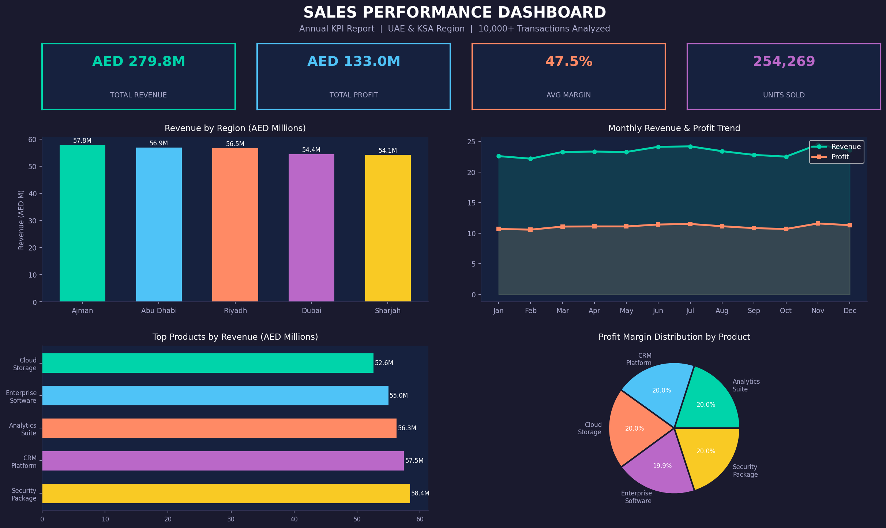

# Sales Performance Analysis Dashboard

*Tools:* Microsoft Excel · Power BI · Power Query · DAX

## Overview
Analyzed 10,000+ sales records to identify revenue trends, top-performing products,
and regional performance gaps. Built an interactive Power BI dashboard for real-time
KPI monitoring and business decision support.

## Key Results
- Improved reporting efficiency by *40%* through Excel automation using Power Query
- Tracked KPIs: total revenue, profit margin, regional sales performance
- Delivered insights that informed pricing strategy and quarterly business planning

## Dashboard Preview

## Features
- Interactive slicers for region, product category, and time period
- Revenue vs target comparison charts
- Top 10 products by profit margin
- Regional performance analysis

## Files
- sales_data.csv — Cleaned and processed sales dataset (10,000+ records)
- screenshots/sales_dashboard.png — Dashboard preview image

## Tools Used
- Microsoft Excel — Data cleaning, Power Query automation
- Power BI — Interactive dashboard and KPI tracking
- DAX — Calculated measures and KPI formulas
- SQL — Data extraction and querying
